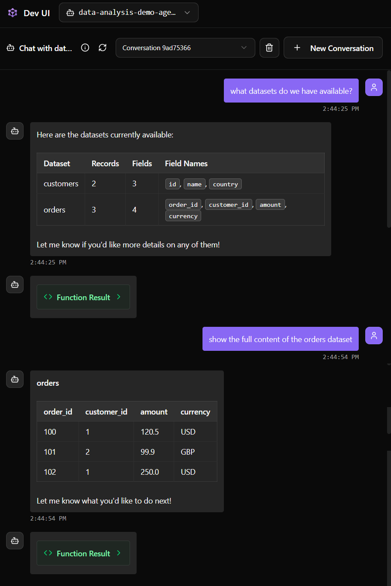

# data-analysis-demo-agent

## 1. Agent Name

**data-analysis-demo-agent**

---

## 2. Agent Purpose

The purpose of this agent is to demonstrate **basic agent development with tool usage** and to illustrate **how responsibility is split between tools and the agent itself**.

This agent is designed to:
- interact with the user about available datasets,
- retrieve structured information via tools,
- reason about and explain datasets in natural language.

This description serves as a **technical task specification for the agent’s system prompt**.

> **Educational focus:**  
> This agent operates on small, in-memory example datasets.  
> It is intentionally simplified and does not represent a complete or production-ready solution.

---

## 3. Agent Tools

This agent uses **three tools**, each illustrating a different level of data preparation.

### 3.1 `list_datasets`

**Purpose:**  
Provides an overview of all available datasets.

**Output includes:**
- dataset name,
- number of records,
- number of fields,
- field names.

**Design principle:**  
The tool returns **fully prepared metadata**, allowing the agent to immediately reason about dataset structure.

---

### 3.2 `describe_dataset(dataset_name)`

**Purpose:**  
Provides detailed information about a single dataset.

**Input:**
- `dataset_name` – name of the dataset to describe.

**Output includes:**
- dataset name,
- number of records,
- number of fields,
- field names,
- one example row.

**Design principle:**  
The tool summarizes the dataset instead of exposing raw data.

---

### 3.3 `show_data(dataset_name)`

**Purpose:**  
Returns the **raw records** of a selected dataset.

**Input:**
- `dataset_name` – name of the dataset.

**Output includes:**
- dataset name,
- raw data rows.

**Educational note:**  
This tool is included **only for demonstration purposes**, for example to produce clearer screenshots or to illustrate what raw data looks like.

> **Important:**  
> In student submissions, tools should generally return **structured, summarized, or aggregated data**, not raw datasets.  
> Raw data access is intentionally shown here as a *counterexample*.

---

## 4. Tool–Agent Responsibility Split

This agent demonstrates the following fundamental rule:

> **Tools are responsible for data retrieval, preparation, and structuring.**  
> **The agent is responsible for reasoning, explanation, and interpretation.**

Examples:
- Tools compute dataset statistics and structure.
- The agent explains what the datasets contain and how they can be interpreted.
- Even when raw data is available, the agent should rely primarily on structured outputs.

This separation is a **core expectation** for student agents in this course.

---

## 5. Example Interaction

---

## 6. Limitations of This Example

- Datasets are hard-coded and stored in memory.
- No file loading or external data sources are used.
- The `show_data` tool exposes raw data, which is **not recommended** for real agents.

> **Note:**  
> This agent is a **reference example**, not a complete lab solution.  
> Student agents should focus on **well-designed tools that return agent-ready data**.

---

## Additional Notes

- This agent represents the **minimum acceptable level** of tool usage.
- It demonstrates both good practices (structured tools) and intentional shortcuts (raw data access).
- Understanding this example is essential before moving on to:
  - agent-as-tool patterns,
  - multi-agent systems,
  - attacker–evaluator–defender scenarios.
