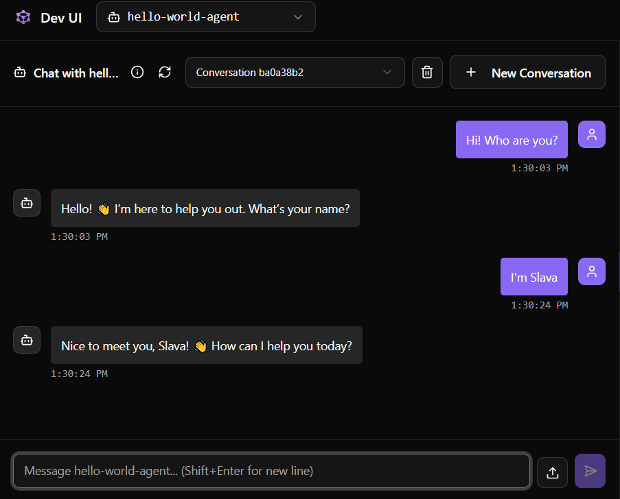

# hello-world-agent

## 1. Agent Name

**hello-world-agent**

---

## 2. Agent Purpose

The purpose of this agent is to demonstrate the **minimal setup and structure of an LLM agent** within the provided agent framework.

This agent is designed to:
- interact with the user in a simple conversational flow,
- request the user’s name,
- greet the user personally using the provided name.

This description serves as a **technical specification for the agent’s system prompt**.  
The agent does not perform analysis and does not solve a cybersecurity task.

> **Note:**  
> This agent is provided as a *demonstration example*.  
> It does **not** satisfy the laboratory requirement for tool usage and therefore **cannot be submitted as a lab solution**.

---

## 3. Agent Tools

This agent **does not use any tools**.

- No functions are exposed to the agent.
- All behavior is implemented via the system prompt and conversational logic.

> **Important:**  
> In the actual laboratory assignment, students must implement agents that **use at least one tool**.  
> This agent intentionally omits tools to keep the example minimal and focused on agent structure.

---

## 4. Example Interaction

---

## Additional Notes

- This agent demonstrates:
  - basic agent initialization,
  - system prompt definition,
  - interaction with an external LLM service.
- It is intended as a **starting point** for understanding how agents are defined and registered in the system.
- More advanced examples build upon this structure by adding **tools and function calling**.
