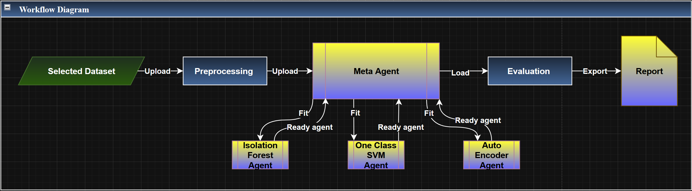

# Anomaly Detection for MITRE ATT&CK T1059 ⚠️

## 📝 Overview

This project explores anomaly detection methods for **MITRE ATT&CK Technique T1059 – Command and Scripting Interpreter**.
T1059 involves the use of command-line interfaces and scripting environments (e.g., PowerShell, cmd, Python) to execute commands on a system. While these tools are commonly used for legitimate administrative tasks, they are also frequently abused by attackers.

The goal of this project is to simulate realistic enterprise command activity and evaluate different anomaly detection algorithms that can identify suspicious command execution patterns.

---

# 🎯 Project Goals

* Simulate enterprise command activity related to **MITRE ATT&CK T1059**
* Generate synthetic datasets representing different enterprise environments
* Apply multiple anomaly detection algorithms
* Evaluate their performance individually and as an ensemble
* Analyze which approaches work best across different enterprise scenarios

---

# 🧪 Synthetic Data Generation

To evaluate anomaly detection methods, synthetic datasets were generated to simulate command execution logs in enterprise environments.

Three enterprise profiles were modeled:

**🏠 Enterprise A – Small Office**

* Few users and hosts
* Predictable working hours
* Low variability in command behavior

**🏢 Enterprise B – Medium Organization**

* More users and occasional off-hour activity
* Moderate variability in command usage

**🌐 Enterprise C – Large 24/7 Enterprise**

* Continuous activity
* Large number of users and commands
* High behavioral variability<br><br>

**Each record includes features such as:**

* Timestamp
* Host ID
* User ID
* User role
* Process and parent process
* Command text
* Script type
* Command length
* Number of arguments
* Execution result
* Label (benign / suspicious)

Approximately **5% of the dataset is labeled as anomalous** to simulate rare attack events.

---

# 🔄 Data Preprocessing

The preprocessing pipeline prepares raw command logs for anomaly detection:

Key steps include:

* **Timestamp feature engineering** using cyclic encoding (sin/cos)
* **Handling missing values**
* **Correlation-based feature reduction**
* **TF-IDF vectorization** for command text
* **Frequency encoding** for categorical features
* **Feature scaling** using `StandardScaler`

The output is a feature dictionary (`X_dict`) that allows different agents to operate on appropriate feature subsets.

---

# 🕵️‍♂️ Anomaly Detection Agents

The system evaluates several anomaly detection algorithms:

### 🌲 Isolation Forest

Tree-based anomaly detection that isolates rare observations in the dataset.

### 🧩 One-Class SVM

Kernel-based method that learns the boundary of normal behavior.

### 🤖 Autoencoder

A neural network trained to reconstruct normal command patterns.
Large reconstruction errors indicate anomalies.

---

# 🏆 Ensemble Detection

The **MetaAgent** can combine the predictions of multiple agents.

Supported strategies:

* **Soft voting** – weighted combination of anomaly scores
* **Hard voting** – majority vote based on agent predictions

This ensemble approach improves detection by leveraging the strengths of different algorithms.

---

# 📊 Evaluation Metrics

The system evaluates models using standard classification metrics:

* **Precision**
* **Recall**
* **F1 Score**
* **Confusion Matrix**

These metrics help analyze the trade-off between detecting true anomalies and avoiding false positives.

---

# 🔁 Workflow

The main workflow includes:

1. Selecting an enterprise dataset
2. Loading command execution logs
3. Preprocessing and feature extraction
4. Training anomaly detection agents
5. Validation and threshold tuning
6. Ensemble evaluation using the MetaAgent
7. Saving predictions and generating reports  



---

# 📁 Results
Holds results of the implementation of the workflow on the various Enterprise logs.  
We'll see now an explanation on the Results directory:<br><br>
EDA/ 🔎

Holds exploratory data analysis before preprocessing for each enterprise:
Enterprise_A_EDA/
Enterprise_B_EDA/
Enterprise_C_EDA/

Includes graphs and summaries of the raw data.

Enterprise_X/ 🏢
Contains results for each enterprise after running the anomaly detection workflow:
Enterprise_X_anomaly_results.csv → Classification for each sample (benign vs. anomaly)
Enterprise_X_metrics_summary.csv → Summary of Recall 🔍, Precision ✅, F1 ⚖️ for each agent
Enterprise_X_report.pdf → Detailed report including agent metrics, ensemble metrics, and confusion matrices 🧾

Enterprise_Comparison/ 📊
Stores comparison visualizations across all enterprises:
Bar plots showing Recall 🔍, Precision ✅, F1 ⚖️ for each agent across enterprises
Useful for benchmarking agent performance across different enterprise scenarios

---

# 🖨️ Reporting

The project automatically generates:

* **CSV summaries** of metrics
* **Confusion matrix visualizations**
* **PDF reports** containing agent performance and ensemble results
* **Cross-enterprise comparisons**

---

# 💡 Key Findings

* **Isolation Forest** provides strong baseline performance across enterprises.
* **One-Class SVM** often produces high recall but may introduce many false positives.
* **Autoencoders** can detect subtle anomalies but may miss some attacks.
* **Ensemble methods** generally achieve the best overall performance by combining multiple detection strategies.

---

# 📂 Project Structure

```
project/
│
├── agents/
│   ├── __init__.py
│   ├── base_agent.py
│   ├── isolation_forest_agent.py
│   ├── svm_agent.py
│   ├── autoencoder_agent.py
│   └── meta_agent.py
│
├── data/
│   ├── data_generation.ipynb
│   ├── Enterprise_A.csv
│   ├── Enterprise_B.csv
│   └── Enterprise_C.csv
│
├── Results/
│   ├── EDA/
│   │   ├── Enterprise_A_EDA/
│   │   ├── Enterprise_B_EDA/
│   │   └── Enterprise_C_EDA/
│   │
│   ├── Enterprise_A/
│   ├── Enterprise_B/
│   ├── Enterprise_C/
│   └── Enterprise_Comparison/
│
├── utils/
│   ├── __init__.py
│   ├── best_hyperparams.py
│   ├── EDA.py
│   ├── evaluation.utils.py
│   ├── preprocessing.py
│   └── report_generator.py
│
├── Visual_Abstract/
│   └── Workflow.png
│
├── Report/
│   ├── Project_report.docx
│   └── Project_report.pdf
│
├── .gitignore
├── bootstrap.py
├── main.py
├── README.md
└── requirements.txt

```

---

# 👨‍💻👨‍💻 Authors

**Yossi Okropiridze**  
**Michael Naftalishen**
